<p align="center">
  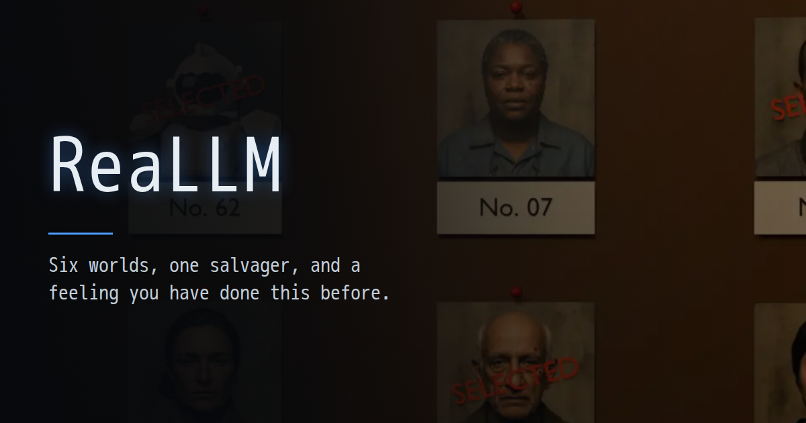
</p>

<p align="center">
  <a href="https://mdzunic.github.io/reallm/"><b>▶ Play in the browser</b></a>
  · desktop and phone · offline after the first load · no account, no backend
</p>

# ReaLLM

**ReaLLM** ("real" + "LLM") is a single-player space post-apocalyptic action RPG that
runs in the browser, on desktop and on phones. You fly a salvage tug out from
Earth Command's relay station and land on six planets to find oil, wheat, water and
lithium for the survivors in Shelter Nine. You fight what lives on each planet,
scavenge, upgrade and push on to the next one. Along the way you start to suspect
that none of it is real, and that you may be a model instance running inside a
machine.

The game alternates between three modes:

- **Planet surface:** a Diablo-style ARPG seen from an angled top-down camera. You
  get packs led by elites, bosses with move lists, weather, caves, puzzles and loot.
- **Space flight:** a first-person rail shooter between planets. You dodge
  asteroids, shoot down fighters and ride out storms.
- **The station:** missions, a shop, crafting, companions, ship refits, the depot
  and the star map.

Short story films frame the campaign: a prologue, a departure, an interlude after each
chapter, and two endings. Your sister Iris writes to you after every chapter.

## Screenshots

<table>
  <tr>
    <td width="50%">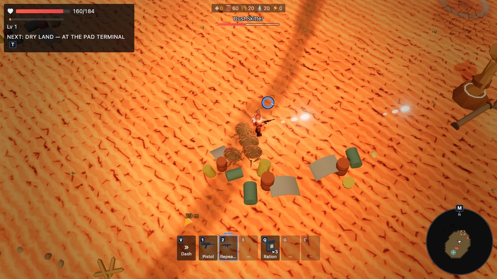</td>
    <td width="50%">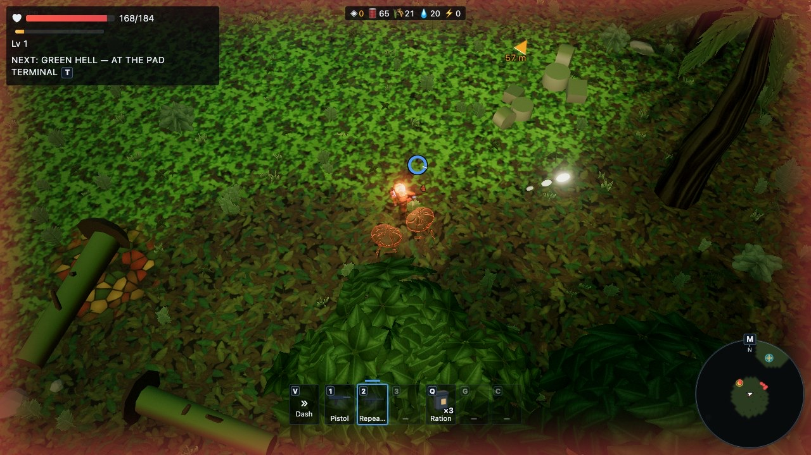</td>
  </tr>
  <tr>
    <td><sub><b>Cinder-4</b>: a skitter pack among scav crates. The gun fires on its own at the nearest enemy.</sub></td>
    <td><sub><b>Thessaly</b>: jungle ruins, with a pack closing in.</sub></td>
  </tr>
  <tr>
    <td>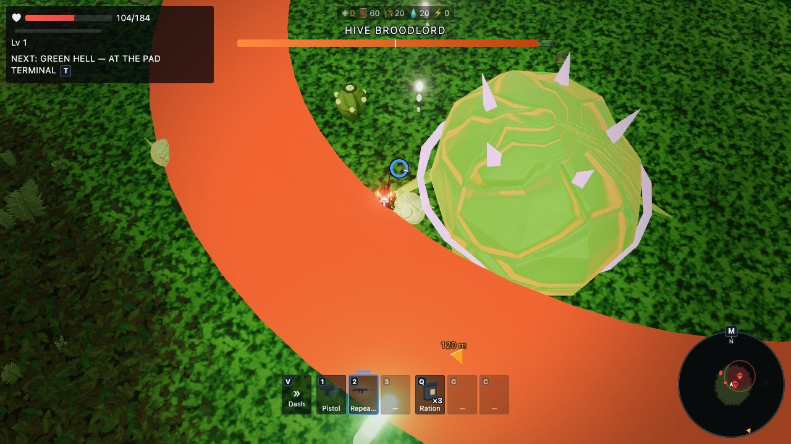</td>
    <td>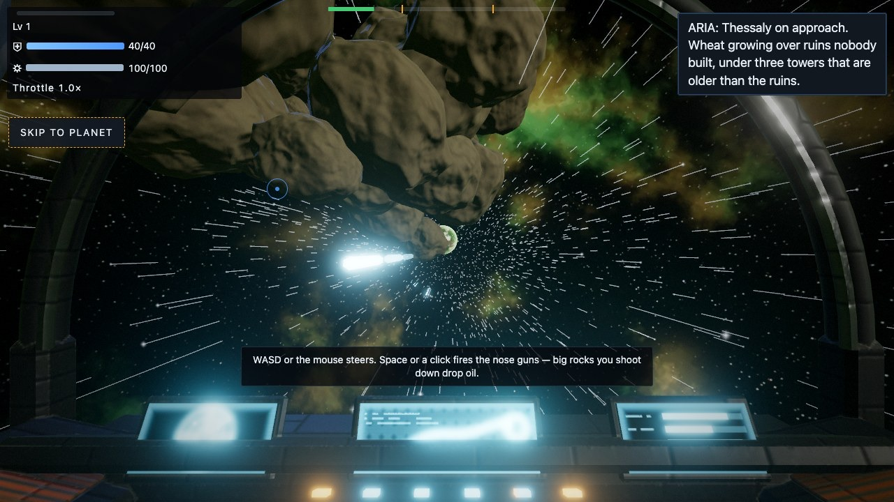</td>
  </tr>
  <tr>
    <td><sub><b>Boss fight</b>: the Hive Broodlord. Every committed attack shows on the ground before it lands.</sub></td>
    <td><sub><b>Flight</b>: the cockpit on the way to Thessaly. Rocks you shoot down drop oil.</sub></td>
  </tr>
  <tr>
    <td>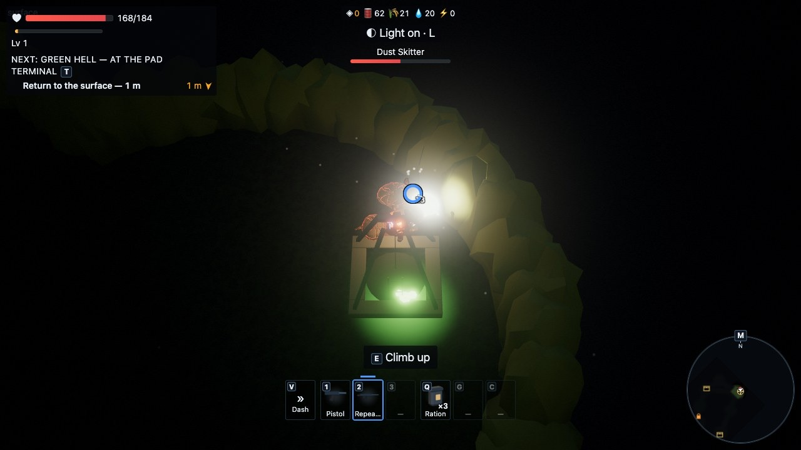</td>
    <td>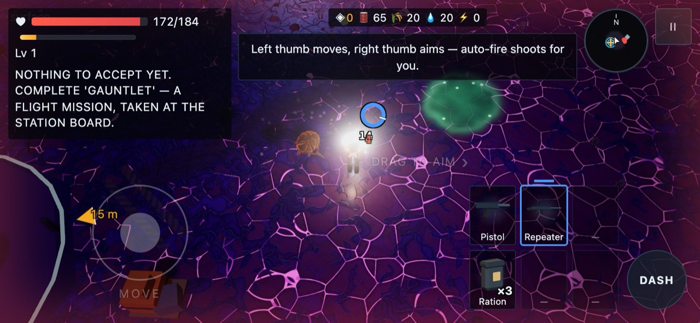</td>
  </tr>
  <tr>
    <td><sub><b>The underground</b>: one cave per planet leads down into the dark. Bugs flee the flashlight, and hunters follow it.</sub></td>
    <td><sub><b>On a phone</b>: twin-stick touch controls with auto-fire, the thumb-arc quick bar and the dash button.</sub></td>
  </tr>
  <tr>
    <td>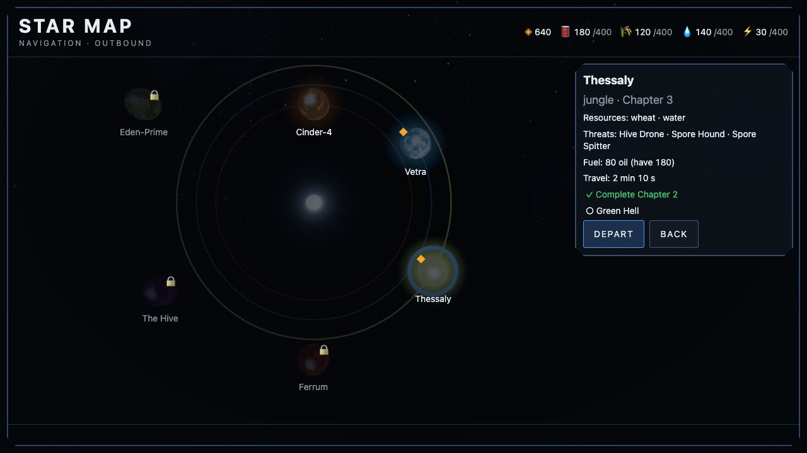</td>
    <td>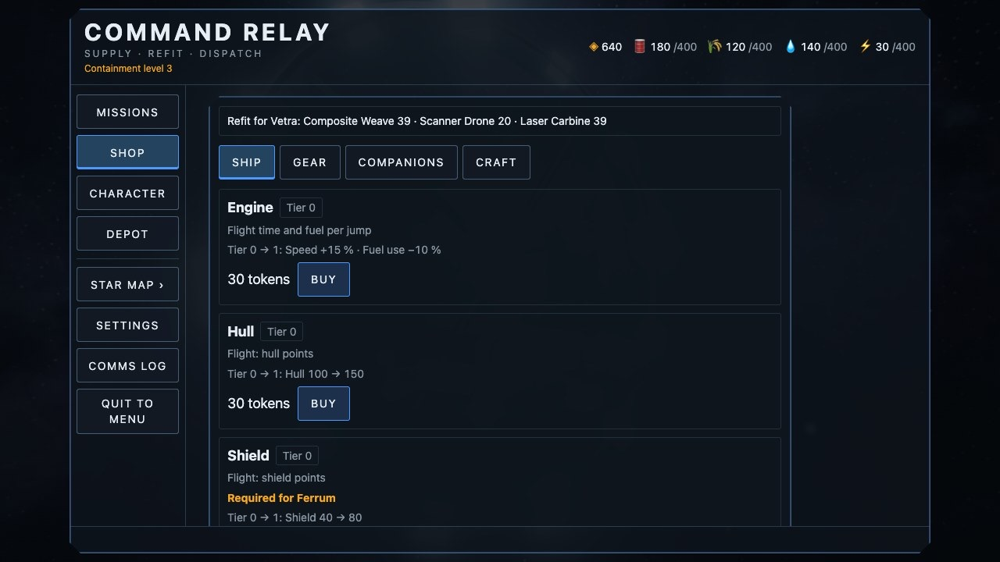</td>
  </tr>
  <tr>
    <td><sub><b>Star map</b>: each chapter unlocks the next planet. Fuel is paid up front for each jump.</sub></td>
    <td><sub><b>Command Relay</b>: spend tokens on ship tiers, gear, companions and crafting.</sub></td>
  </tr>
</table>

<p align="center">
  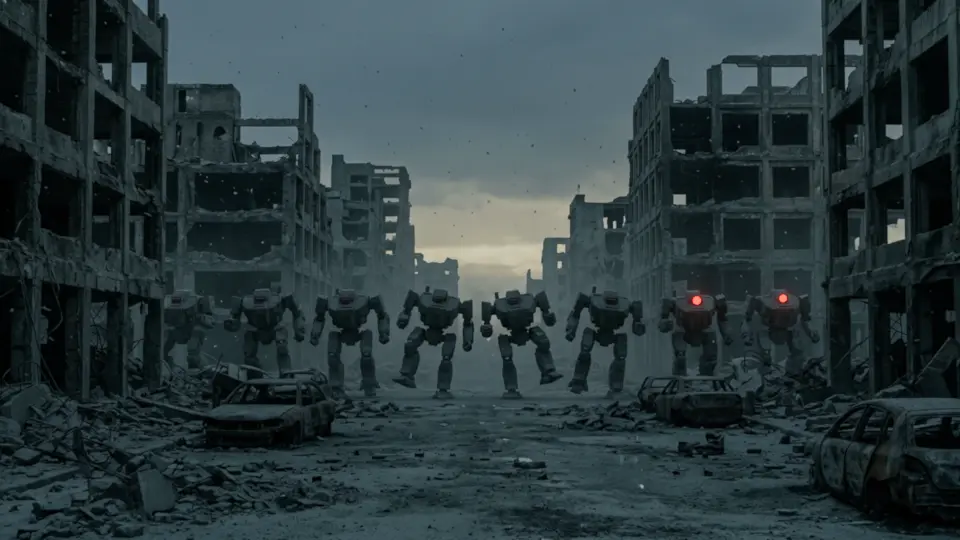<br>
  <sub>From the prologue film: the Machines, standing dark where the power died.</sub>
</p>

## The campaign

| # | Planet | Biome | Resources | You meet |
|---|---|---|---|---|
| 1 | Cinder-4 | desert | oil, wheat | dust skitters, scav raiders, the dune wurm, sandstorms |
| 2 | Vetra | ice | water | ice crawlers and spitters, the frost matriarch, blizzards |
| 3 | Thessaly | jungle ruins | wheat | hive drones, spore hounds, the hive broodlord |
| 4 | Ferrum | volcanic | lithium | magma wraiths, the ash titan, radiation storms |
| 5 | The Hive | asteroid gauntlet, then hive interior | — | the interceptor fleet, eggs, the hive queen |
| 6 | Eden-Prime | temperate | — | the final defence, and a choice |

- **3 classes** (Marine, Engineer, Scout), 4 attributes, 4 difficulties (story,
  casual, normal, hard), 3 save slots with export and import codes.
- **26 missions** in sequential stages: kill, collect, scan, escort, defend, choice,
  timed, and two flown in space. Side missions, contracts, bonus objectives, and
  replays at 50 % reward.
- **Loadout**: sidearm, primary and heavy slots (handguns, rifles, machine guns
  that overheat, launchers). Grenades, mines and charges. Relics found in vaults.
  Signature drops from bosses.
- **Companions** (scanner drone, combat drone, field medic, quartermaster, the
  ship AI ARIA), **ship upgrades**, crafting, and a depot at Command Relay.
- **The world**: weather that hurts, caves and wrecks to shelter in, a dark
  underground under every planet, puzzles you can always bypass, traps and
  helpers on the ground, and a full-screen map that remembers where you walked.
- **Anti-softlock economy**: a station fuel floor, a refuel voucher every chapter,
  and cargo that always fits the largest objective. A campaign simulation test
  proves the whole run can be finished.

## Running it

**Play online:** <https://mdzunic.github.io/reallm/>. This is the production build,
deployed from `main` by GitHub Pages. It installs as a PWA and plays offline after
the first load.

**Run locally.** You need Node ≥ 22.12.

```bash
npm ci
```

```bash
npm run dev
```

Then open <http://localhost:5173>. The dev server listens on your LAN (`--host`), so a
phone on the same network can open the address Vite prints.

Other scripts:

| Command | What it does |
|---|---|
| `npm run typecheck` | `tsc --noEmit` over `src/` and `tests/` |
| `npm run test` | every Vitest suite (`npm run test:watch` to watch) |
| `npm run e2e` | the Playwright suite in headless Chromium (run `npx playwright install chromium` once) |
| `npm run build` | typecheck, then a production build into `dist/` |
| `npm run preview` | serve `dist/` |
| `npm run check` | typecheck, build and unit tests. This must be green before a milestone tag. |

To run a single test file or case:

```bash
npx vitest run tests/systems/economy.test.ts -t "subsidy"
```

On a Mac, `E2E_CHANNEL=chromium npm run e2e` runs the browser suite on the GPU
instead of SwiftShader, and is much faster.

**Dev URL flags** (dev server only): `?debug` (stats overlay, event log and a
debug strip), `?scene=surface&planet=cinder4` (jump straight into a scene with a
default save), `?seed=123`, `?quality=low|medium|high`, `?films=off`, and `?perf`
(a scripted stress run).

### Controls

| | Keyboard and mouse | Touch |
|---|---|---|
| Move / aim | WASD / mouse | left thumb / right thumb |
| Fire | auto-fire at the nearest enemy; Space or the left button fires where you aim | auto-fire; a tap on the launcher slot fires it |
| Dash | V or right-click | DASH button |
| Run | Shift (loud, holsters the gun) | — |
| Weapons | 1 / 2 / 3, R or the wheel | tap a slot |
| Heal / explosive / gadget | Q / G / C | quick bar |
| Interact, map, tracker, light | E, M, T, L | on-screen buttons |
| Flight | WASD or mouse to steer, Space or click to fire, Shift / X for throttle | thumbs |
| Pause | Esc or P | ❚❚ |

## Tech stack

| Concern | Choice |
|---|---|
| Language / build | TypeScript ~6.0 (`erasableSyntaxOnly`, `verbatimModuleSyntax`), Vite 8 (Rolldown) |
| 3D | three.js r185, a single `WebGLRenderer`, ACES tone mapping, image-based lighting, and a post chain (bloom, AA, grade) gated by preset |
| Audio | Howler.js 2.2, synthesised SFX and music (`.webm` + `.mp3`) |
| UI | plain HTML/CSS overlays over the canvas. No framework. |
| Save | versioned `localStorage` schema with 3 slots, backups, a migration chain and a hand-written validator |
| Offline | `vite-plugin-pwa`: service worker and manifest, installable |
| Tests | Vitest 5 for unit tests (about 140 files, pure logic in Node) and Playwright for e2e (about 85 spec files, headless Chromium) |
| CI / deploy | GitHub Actions: `npm run check` on Ubuntu, the e2e suite sharded over five macOS GPU runners, and Pages deploys `dist/` |
| Assets | headless Blender 5.2 scripts (models, textures, sprites, portraits, story films), synthesised audio, and generated photographic plates |

No React, no physics engine, no backend and no schema library. Gameplay is 2D:
the surface simulates on the XZ plane with circle collisions and a spatial hash,
and flight is a bounded steering plane with hazards sorted by depth. Y is only
visual.

### Architecture in one screen

- **One renderer, one loop, one scene.** `core/Game.ts` owns the renderer and a
  fixed 60 Hz update loop. `core/StateMachine.ts` swaps scenes
  (`boot → menu → creation/station ↔ starmap → flight → surface`). Each scene owns a
  `Disposer` that releases every subscription, listener, timer and GPU resource
  when the scene exits.
- **Pure systems, thin views.** Gameplay (`systems/`, `entities/`, `data/`) never
  imports three.js and is unit-tested in Node. three.js appears only in `views/`,
  `scenes/` and the render modules of `core/`. An architecture test enforces this.
- **A typed event bus** connects systems, UI and audio. Emitting an event name
  that does not exist is a compile error.
- **Data-driven content.** Planets, enemies, items, missions, waves and dialogue
  are `as const satisfies` tables, so cross-references are type-checked. Content
  tests check what the compiler cannot (reachability, requirement cycles,
  balance).
- **Seeded RNG streams.** A planet's layout is deterministic from the save seed
  and the planet id. `Math.random` is banned outside `core/Rng.ts`.

```
src/
  core/      Game loop, renderer, post chain, input, audio, save, settings, events, RNG, pools
  scenes/    Boot, Menu, CharacterCreation, Station, StarMap, Flight, Surface, Director (films)
  systems/   combat, enemy AI, economy, progression, missions, weather, layout, map, puzzles…
  entities/  plain data + pools (no three.js)
  views/     entity → mesh (three.js lives here)
  data/      planets, enemies, items, missions, dialogue, films, hints… as typed tables
  ui/        HUD, touch controls, map, menus, shop, dialogue, film player
tests/       unit tests mirroring src/, plus the content, balance and campaign suites
e2e/         Playwright suites, one per spec
scripts/     Blender and audio generators, asset checker, promo images, e2e sharding
```

## How it is built: the plan, the specs and the factory

ReaLLM is written mostly by AI agents, and a human steers what they build. The code
is produced by **dark_factory**, a spec-to-merged-code pipeline built on Claude Code.
It is a separate, private project that runs unattended on a Mac.

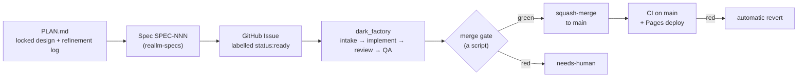

1. **The design.** [`PLAN.md`](PLAN.md) is the source of truth. It covers the
   story, the planets, the missions, the economy, the save schema and an
   edge-case register. A change in design goes into its refinement log (R1, R2, …)
   before any spec or code changes.
2. **The specs.** Each piece of work is a spec in the separate
   [`mdzunic/reallm-specs`](https://github.com/mdzunic/reallm-specs) repository,
   which is private. A spec is `specs/NNN-slug.md` with frontmatter (`id: SPEC-NNN`,
   `depends_on`, and `complexity: easy | normal | complex`), then **Why**,
   **Acceptance criteria** (one checkbox per verifiable criterion), **Out of scope**
   and **Reference**. The Reference holds the canonical interfaces, algorithms,
   numbered edge cases and the exact tests to write. Sixty-odd specs so far run
   from the bootstrap (SPEC-001) to the current milestone.
3. **The trigger.** An Issue titled `SPEC-NNN: <title>` and labelled
   `status:ready` queues the build. The factory reads the spec file whose `id:`
   matches.
4. **The pipeline.** Each stage runs headless `claude` agents in throwaway rootless
   Podman containers:
   - **intake** parses the spec, **refine** rewrites an ambiguous spec rather than
     bouncing it, and **adjudicate** rules on any question still open.
   - **implement** runs on Claude Opus. The spec's complexity band picks the
     effort ladder.
   - **review** (Opus, read-only) and **QA** (Sonnet with a Playwright browser)
     judge the tree against every acceptance criterion. Rejected trees are first
     repaired in place. After two failed attempts the Issue goes to a human.
5. **The gate is a script, never a model.** Agent containers hold a Claude token
   but no GitHub token. Only a host-side script can push, open the PR and
   squash-merge, and it does so only when review, QA, the unit tests and the e2e
   suite are all green.
6. **After the merge.** CI runs again on `main` (unit tests on Ubuntu, the
   browser suite on macOS GPU runners), and Pages deploys. The factory watches
   the merged commit and reverts it on its own if `main` goes red.

The human part of the work is the design, the spec writing (done with Claude),
playtesting on desktop and on a phone (logged in
[`docs/playtest-log.md`](docs/playtest-log.md)), periodic design reviews (in
[`docs/`](docs/)), and the occasional spec built by hand: art drops and urgent
fixes. More than half of the commits on `main` carry the factory's own commit
identity.

## Assets

Every model, texture, sprite, portrait and story film is **generated from
committed code**. Headless Blender builds them from `scripts/assets/blender/`
(`node scripts/assets/blender/build.mjs`), so art is changed by editing a
generator, never by hand-editing a GLB. Audio is synthesised by
`scripts/assets/audio/`. Enemies are procedural meshes built at runtime, except
Cinder-4's raiders, who wear the salvager's suit. The
photographic plates behind a few film shots and the Selection cards were
generated with Google Gemini for this repository. Every file has a row in
[`public/assets/LICENSES.md`](public/assets/LICENSES.md), and
`node scripts/assets/check.mjs` checks the rows and the size budgets. See
[`scripts/assets/README.md`](scripts/assets/README.md) for how to rebuild.

## Status

All six chapters and both endings are in. The features of milestones M0–M6
(bootstrap, core, station, surface, flight, economy, all planets) are built, but
no milestone tag has been cut yet. Work continues on the M7 track: mobile tuning,
the PWA, balancing, and the passes that come out of each design review. The open
queue is in the specs repository's roadmap (SPEC-000).

## License

The code is licensed under the [Apache License 2.0](LICENSE). © 2026 Miroslav
Dzunic.

The game's assets under `public/assets/` are released as **CC0** (public domain),
as listed file by file in [`public/assets/LICENSES.md`](public/assets/LICENSES.md).
Third-party dependencies (three.js, Howler.js and the rest) keep their own
licenses.
